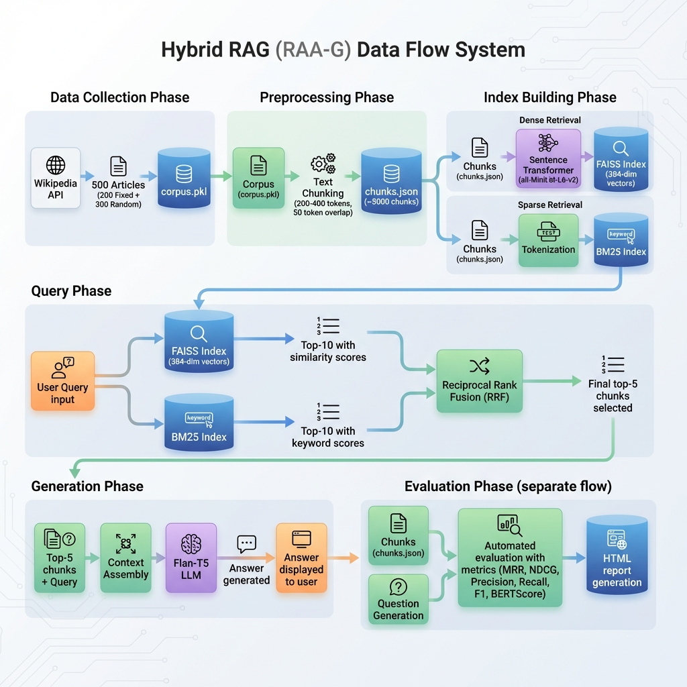

# Hybrid RAG System

A question answering system that retrieves relevant Wikipedia articles and generates answers using a language model.

## System Architecture



The system works in 5 stages:
1. **Data Collection** - Scrapes 500 Wikipedia articles (200 fixed + 300 random)
2. **Preprocessing** - Splits articles into smaller chunks (200-400 words each)
3. **Indexing** - Creates two search indices (FAISS for semantic search, BM25 for keyword search)
4. **Retrieval** - Combines both search methods using Reciprocal Rank Fusion (RRF)
5. **Generation** - Uses Flan-T5 model to generate answers from retrieved chunks

## Quick Start

### Option 1: Run Everything (Recommended)

```bash
./run.sh
```

This script handles the full setup automatically.

### Option 2: Step by Step

```bash
# 1. Create virtual environment
python3 -m venv venv
source venv/bin/activate

# 2. Install packages
pip install -r requirements.txt

# 3. Collect Wikipedia data (takes 15-20 min)
python src/data_collection.py

# 4. Process text into chunks
python src/preprocessing.py

# 5. Build search indices
python src/hybrid_retrieval.py

# 6. Start the web app
cd ui && python app.py
```

Open http://localhost:5000 in your browser.

## Project Structure

```
├── src/                     # Main code
│   ├── data_collection.py   # Downloads Wikipedia articles
│   ├── preprocessing.py     # Splits text into chunks
│   ├── embeddings.py        # Creates vector embeddings (FAISS)
│   ├── sparse_retrieval.py  # Keyword search (BM25)
│   ├── hybrid_retrieval.py  # Combines both search methods
│   └── llm_generation.py    # Generates answers
│
├── evaluation/              # Testing and metrics
│   ├── question_generation.py  # Creates test questions
│   ├── metrics.py              # MRR, NDCG, BERTScore calculations
│   ├── pipeline.py             # Runs the evaluation
│   └── report_generator.py     # Creates HTML report
│
├── ui/                      # Web interface
│   ├── app.py               # Flask server
│   └── templates/           # HTML pages
│
├── data/                    # Generated files (not in git)
│   ├── corpus.pkl           # Downloaded articles
│   ├── chunks.json          # Processed text chunks
│   ├── faiss_index.bin      # Vector search index
│   └── bm25_index.pkl       # Keyword search index
│
├── reports/                 # Evaluation outputs
│   └── evaluation_report.html
│
├── config.py                # Settings
├── run.sh                   # Setup script
├── run_evaluation.py        # Run tests
└── requirements.txt         # Python packages
```

## Running the Evaluation

```bash
python run_evaluation.py
```

This will:
- Generate 100 test questions from the corpus
- Run each question through the system
- Calculate retrieval and generation metrics
- Create an HTML report with charts

View results at `reports/evaluation_report.html`

## Metrics

**Retrieval Metrics:**
- MRR (Mean Reciprocal Rank) - How high is the correct answer ranked?
- NDCG@5 - Considers position of relevant results
- Precision/Recall/F1 - Standard retrieval metrics

**Generation Metrics:**
- BERTScore - Semantic similarity between generated and expected answer
- ROUGE-L - Word overlap with expected answer
- BLEU - N-gram overlap score

## How It Works

### Hybrid Retrieval

We use two search methods together:

1. **Dense Retrieval (FAISS)** - Converts text to vectors using sentence-transformers, finds similar vectors
2. **Sparse Retrieval (BM25)** - Traditional keyword matching with TF-IDF weights

Results from both are merged using RRF (Reciprocal Rank Fusion):
```
RRF_score = 1/(k + rank_dense) + 1/(k + rank_sparse)
```

This gives better results than either method alone.

### Answer Generation

The top 5 retrieved chunks are passed to Flan-T5-base along with the question. The model generates a natural language answer based on the context.

## Configuration

Edit `config.py` to change:

```python
# Dataset
FIXED_URL_COUNT = 200      # Wikipedia articles from fixed list
RANDOM_URL_COUNT = 300     # Additional random articles

# Chunking
CHUNK_SIZE = 300           # Words per chunk
CHUNK_OVERLAP = 50         # Overlap between chunks

# Retrieval
DENSE_TOP_K = 10           # Candidates from FAISS
SPARSE_TOP_K = 10          # Candidates from BM25
RRF_K = 60                 # RRF smoothing factor

# Evaluation
QUESTIONS_COUNT = 100      # Test questions to generate
```

## Docker

```bash
# Build and run
docker-compose up --build

# Stop
docker-compose down
```

## Troubleshooting

**"corpus.pkl not found"**
```bash
python src/data_collection.py
```

**"chunks.json not found"**
```bash
python src/preprocessing.py
```

**"faiss_index.bin not found"**
```bash
python src/hybrid_retrieval.py
```

**Out of memory**
- Reduce `DENSE_TOP_K` and `SPARSE_TOP_K` in config.py
- Close other applications

**Slow data collection**
- Normal, Wikipedia has rate limits
- Takes 15-20 minutes for 500 articles

## Requirements

- Python 3.10+
- 8GB RAM (for embeddings)
- Internet connection (for data collection)

## Dependencies

Main packages:
- sentence-transformers (embeddings)
- faiss-cpu (vector search)
- rank-bm25 (keyword search)
- transformers (Flan-T5 model)
- flask (web interface)
- bert-score (evaluation metric)

See requirements.txt for full list.
