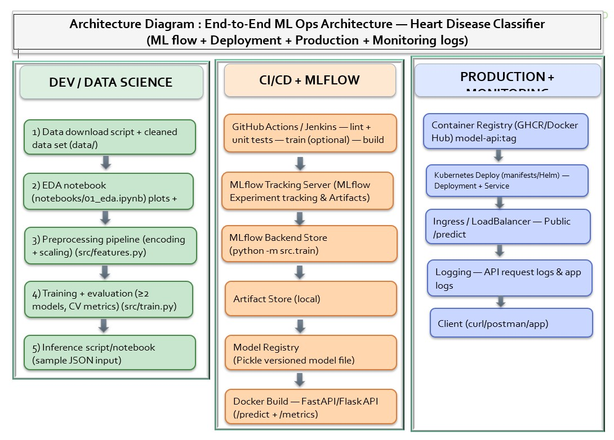

# Heart Disease Prediction – End-to-End MLOps Pipeline

## Overview

This project implements an end-to-end MLOps pipeline to predict the presence of heart disease using the UCI Heart Disease dataset. 
The solution demonstrates the complete lifecycle of a production-grade machine learning system, covering data preprocessing, automated testing, experiment tracking, model versioning, continuous integration/deployment (CI/CD), and API-based inference running in a containerized environment (Docker/Kubernetes).

## Essential Links & Documentation

To fully understand the scope and implementation of this project, refer to the following resources:

**Project Documentation:**
- **Assignment Instructions:** [MLOPs_assignment_3rd_sem_instructions.pdf](../MLOPs_assignment_3rd_sem_.pdf)
- **Final Group Submission Report:** [MLOPS_Assignment_1_Group_3_Submission.pdf](../MLOPS_Assignment_1_Group_3_Submission.pdf)
- **Setup & Install Instructions:** [Setup-Install-Instructions.pdf](../Setup-Install-Instructions.pdf)

**Repository & Deployment Resources:**
- **Code Repository:** [GitHub Repository Source](https://github.com/KSharma-SourceCode/AI-ML-Assignments/tree/main/M-Tech.%20Semester%203/MLOPS/Assignment-1/heart-disease-mlops)
- **Docker Hub Registry:** [ksharmadockerhub/heart-disease-api](https://hub.docker.com/repository/docker/ksharmadockerhub/heart-disease-api/general) (`docker pull ksharmadockerhub/heart-disease-api:latest`)
- **Deployment Manifests (Helm):** [Helm Charts Source](https://github.com/KSharma-SourceCode/AI-ML-Assignments/tree/main/deployment/helm/heart-disease)
- **CI/CD & Deployment Workflow:** [GitHub Actions](https://github.com/KSharma-SourceCode/AI-ML-Assignments/actions)

**Video Walkthroughs:**
- **YouTube:** [Watch Here](https://youtu.be/ItkbTRBYdCc)
- **Google Drive:** [Watch Here](https://drive.google.com/file/d/1ZZHr5nZQmbYlZRzWCo-gNwi-Z2TJdB3e/view)

---

## Project Architecture & Workflows



A real-world ML application requires robust tracking and dependable infrastructure. This project achieves this through:
- **Experiment Tracking:** Utilizing MLflow to centrally track parameters, model metrics, and artifacts across multiple training runs.
- **Microservice Architecture:** Serving the trained models via a highly concurrent FastAPI application.
- **Containerization & Orchestration:** Packaging the API using Docker and providing reliable deployment strategies using Kubernetes (K8s).
- **CI/CD Automation:** Automated workflows enabled by GitHub Actions that execute code linting, run PyTest validations, and build deployments automatically.

### Repository Navigation
To understand the full scope of the implementation, explore these key directories:
- **src/**: Contains the core application and training logic (preprocess.py, train.py, app.py).
- **notebooks/**: Contains step-by-step exploratory data analysis (EDA) and prototype training.
- **k8s/**: Holds Kubernetes manifests handling deployments, services, scaling, and load balancing real-world traffic.
- **tests/**: Contains automated unit tests validating model robustness and pipeline data integrity.
- **screenshots/**: Visual proofs of the CI/CD pipeline, API performance, MLflow UI, and Kubernetes deployments.

---

## Real-Life Applications
The MLOps patterns established in this pipeline are fundamental for scaling real-world AI applications:
1. **Clinical Decision Support Systems:** Deploying similar medical predicting APIs allows doctors to input patient vitals in real-time, receiving instant risk assessments backed by automated ML model updates.
2. **Fraud Detection Platforms:** The CI/CD and rapid model versioning established here allow FinTech systems to push newly trained fraud detection models to production instantly as new attack patterns emerge.
3. **Automated Risk Profiling:** Insurance companies can use similar scalable classification pipelines mapped to continuous monitoring (Prometheus/Grafana) to process thousands of applications concurrently relying on Kubernetes load balancers.

---

## Problem Statement

Predict whether a patient has heart disease based on clinical and diagnostic attributes using a binary classification model.

---

## Dataset

- **Name:** UCI Heart Disease Dataset (Cleveland subset)  
- **Records:** 303 (after cleaning: 297)  
- **Features:** 14  
- **Target:** Heart disease (0 = No, 1 = Yes)

---

## Setup Instructions

```bash
python -m venv venv
venv\Scripts\activate # Windows
source venv/bin/activate # Mac/Linux
pip install -r requirements.txt
```

---

## Testing
We ensure code quality and training repeatability through standard unit testing protocols:

```bash
pytest
```

---

## Model Training
Train the classification model and log all relevant experiments, metrics, and hyper-parameters using MLflow:

```bash
python -m src.train
```

---

## MLflow Experiment Tracking
Visualize and compare model run iterations by spinning up the local MLflow dashboard:

```bash
mlflow ui
```
Access at: http://localhost:5000

---

## Running to a Production Virtual Machine (VM)

If deploying outside Kubernetes, you can pull the pre-packaged container and serve it securely on any remote machine.

1. **Pull the Docker Image**
```bash
docker pull ksharmadockerhub/heart-disease-api:latest
```

2. **Run the Container**
Deploy as a background daemon mapping the service to port 8000:
```bash
docker run -d -p 8000:8000 -e ENV=production --name heart-disease-api ksharmadockerhub/heart-disease-api:latest
```

3. **Verify Deployment**
Open your browser and navigate to:
http://localhost:8000/docs
*(Replace `localhost` with the VM's public IP address if verifying externally.)*

---

## FastAPI Inference Service
Deploy the local inference server securely to handle prediction traffic:

```bash
uvicorn src.app:app --reload
```
Interact directly through the automated Swagger UI: http://127.0.0.1:8000/docs

---

## API Contract

### Endpoint
POST `/predict`

### Request Example
```json
{
  "age": 63,
  "sex": 1,
  "cp": 1,
  "trestbps": 145,
  "chol": 233,
  "fbs": 1,
  "restecg": 2,
  "thalach": 150,
  "exang": 0,
  "oldpeak": 2.3,
  "slope": 3,
  "ca": 0,
  "thal": 6
}
```

### Expected Response
```json
{
  "heart_disease": 0,
  "confidence": 0.3271
}
```

---

## Conclusion
This assignment demonstrates a complete MLOps workflow progressing from raw data and notebook exploration to a highly-available deployable ML microservice. It heavily emphasizes the reproducibility, scaling reliability, continuous tracking, and production readiness required by modern AI engineering teams.
